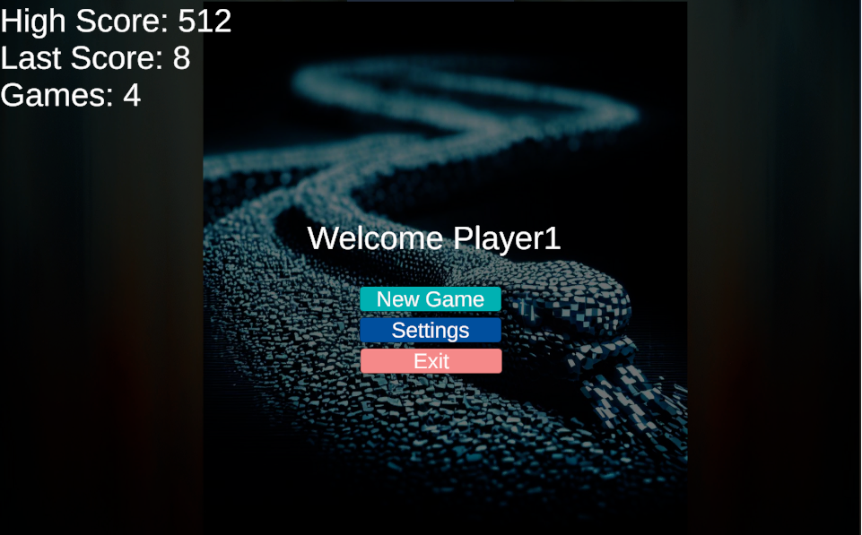

# SnakeGame
A little unity snake game I'm working on.

In the game you control a cube eating up numbers. When you eat a number bigger than yourself, you gain that much power. Smaller numbers are added to your tail until they get big enough to be eaten in turn.

[Current Build](https://play.unity.com/mg/other/builds-1d-12)